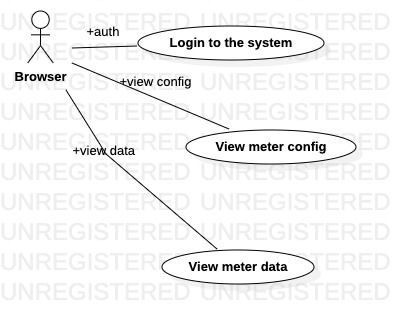
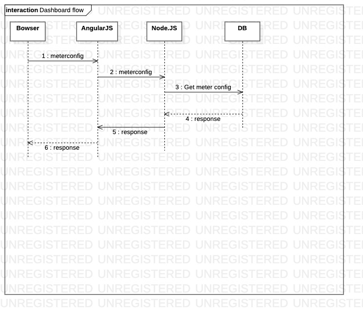

<!-- vscode-markdown-toc -->
* 1. [Vision](#Vision)
* 2. [Requirements break-down](#Requirementsbreak-down)
	* 2.1. [Functional requirements](#Functionalrequirements)
		* 2.1.1. [Data upload](#Dataupload)
		* 2.1.2. [Data visualization](#Datavisualization)
	* 2.2. [Non-functional requirements](#Non-functionalrequirements)
	* 2.3. [Non-requirements](#Non-requirements)

<!-- vscode-markdown-toc-config
	numbering=true
	autoSave=true
	/vscode-markdown-toc-config -->
<!-- /vscode-markdown-toc -->

# 1. Smartfi server system

##  1. Vision
Smartfi system enables multiple IOT devices to send its data to common server. This data will be used to visualize and troubleshoot IOT devices under consideration

##  2. Requirements break-down
###  2.1. Functional requirements
####  2.1.1. Data upload
* A client should be able to upload data periodically
* A client should be able to retry data upload
* Client can upload data in different scaling of units. Server should normalize them in SI scaling of unit before storing to DB
* A client may provide data timestamp and in this case, system should use the same. 
    * Timestamp will be in UNIX format (number of epochs)
    * System will store data marking timestamp, if needed. Timestamp granuality is minute
* Multiple clients should be able to upload data concurrently
* System should store data in such a way that consumer can distinguish among data for each source (client IOT device)
* Only registered client should be able to interact with system

####  2.1.2. Data visualization
* System should be able to generate report and send it via mail
* Requirement for reports (with miximum, minimum & average) with charts:- Lists of report types
    * Energy vs cost :-
        * Energy vs cost data of different meters (Energy Vs Cost Report)
        * Energy Generation (Chart-Generation Energy Vs Cost)
        * Energy Consumptions (Chart-Consumption Energy Vs Cost)
    * Daily Energy Data(i.e. 24hr consumption) with graph
    * Log Book of energy cnsumptions with graph:-
        * 15-minutes (Logbook15Minutes)
        * 30-minutes (Logbook30Minutes)
        * Hourly (LogbookHourly)
    * Group wise Energy Report with chart (Group Report)
    * Shift Energy Report :-
        * with cost
        * without cost

###  2.2. Non-functional requirements
* Server should be fair in processing multiple client data upload. Upload should be reasonably fast and there should not be any starvation
* Client should not wait while uploading data 
* Client should get success or failure for its request
* Data upload should be atomic (all or none)
* Server should handle  malformed data upload request gracefully and it should not impact availability
* System should be able to cleanup old data(more than 5 years old) so that DB will not overflow. User should be able to configure this value.

###  2.3. Non-requirements
* Edit of data which is already uploaded is not considered
* Timestamp granuality more than minute is not considered

## Visualization design flow

### Visualization use-case
#### Below use-case talks about meter data fetch

### Dashboard Deployment diagram

### Dashboard sequence diagram
